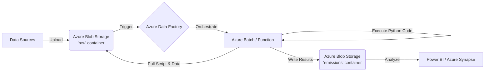

# Azure Integration Guide: Emissions Calculation System

This guide outlines how to integrate your Python-based emissions calculator with **Azure Cloud**, specifically using **Azure Data Factory (ADF)** for orchestration and **Azure Blob Storage** for data management.

## Architecture Overview



## Prerequisites
1.  **Azure Subscription**
2.  **Resource Group** (e.g., `rg-emissions-calc`)
3.  **Storage Account** (e.g., `stemissionsstorage`)
4.  **Azure Data Factory** (e.g., `adf-emissions-calc`)
5.  **Compute Target** (Azure Batch Account OR Azure Function App)

---

## Step 1: Storage Setup (Azure Blob Storage)
Move your local folders to Azure Blob Storage containers.

1.  Create a Container named `emissions-data`.
2.  Create directory structure inside:
    *   `/raw` (Upload your CSVs here: `sample_materials.csv`, `sample_transport.csv`)
    *   `/config` (Upload `data_config.json`)
    *   `/emissions` (Empty, for outputs)
    *   `/scripts` (Upload your Python `.py` files here)

---

## Step 2: Compute Setup (Recommended: Azure Batch)
For running Python scripts "as-is" with dependencies (pandas, requests), **Azure Batch** is the most robust integration with ADF.

1.  **Create Azure Batch Account**:
    *   Link it to your Storage Account.
2.  **Create a Pool**:
    *   **Image**: Ubuntu Server or Windows Server (with Container support is best).
    *   **Start Task**: Install Python dependencies.
        ```bash
        /bin/bash -c "apt-get update && apt-get install -y python3-pip && pip3 install pandas requests openpyxl"
        ```

---

## Step 3: Code Adaptation (Minimal)
ADF's "Custom Activity" automatically downloads files to the compute node. However, to ensure paths work smoothly, modify `universal_data_loader.py` to check for an environment variable or command line argument for the base path.

**Current:**
```python
base_dir = Path(__file__).resolve().parents[2]
```

**Recommended for Cloud:**
```python
import os
# ...
base_dir = Path(os.getenv("AZ_BATCH_TASK_WORKING_DIR", "."))
# ...
```

---

## Step 4: Azure Data Factory (ADF) Pipeline

1.  **Create Linked Services**:
    *   **Azure Blob Storage**: To access data.
    *   **Azure Batch**: To run the compute.

2.  **Create a Pipeline** (`PL_Calculate_Emissions`):
    *   Add a **Custom Activity**.
    *   **Name**: `RunCalculationScript`.
    *   **Linked Service**: Select your Azure Batch LS.
    *   **Command**: 
        ```bash
        python3 calc_transport_emissions.py
        ```
    *   **Resource Linked Service**: Select your Storage LS.
    *   **Folder Path**: Point to your `scripts` folder in Blob Storage.
    *   **Reference Objects**:
        *   Add Input Datasets pointing to `raw/*.csv` and `config/*.json`.
        *   Add Output Datasets pointing to `emissions/`.

3.  **Trigger**:
    *   Set up a **Storage Event Trigger** to run the pipeline whenever a new file lands in `raw/`.

---

## Alternative: Azure Functions (Serverless)
If you prefer a lighter-weight approach (no batch pool management):

1.  Create an **Azure Function App** (Python stack).
2.  Refactor your code into an HTTP Trigger function.
3.  In ADF, use the **Azure Function Activity** to call your API endpoint.
4.  *Note: Azure Functions have a 5-10 minute timeout default. If your datasets are huge, stick to Azure Batch.*

---

## Next Steps
1.  **Modify `UniversalDataLoader`** to accept a dynamic base path (I can help with this code change).
2.  **Provision Azure Resources**.
3.  **Deploy Pipeline**.
